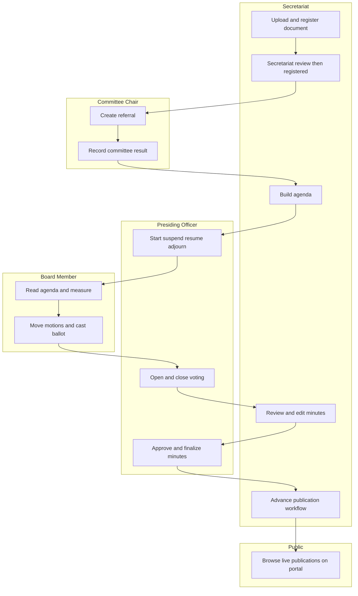
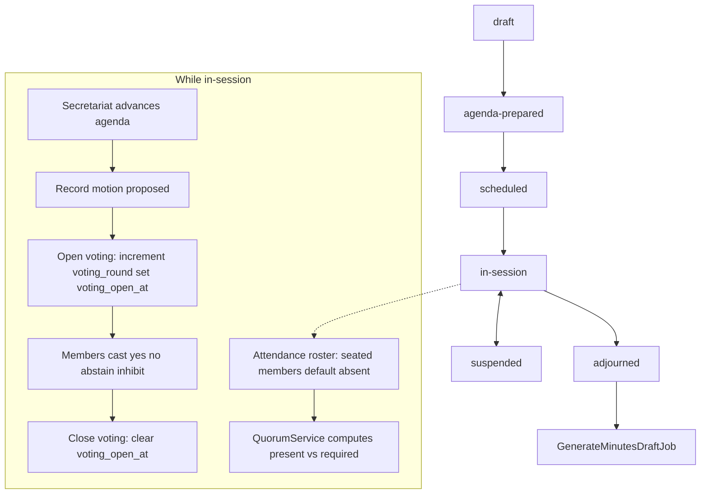
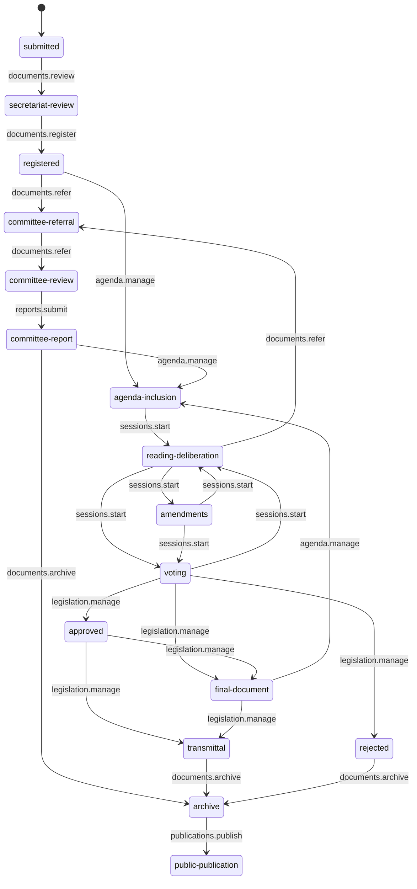
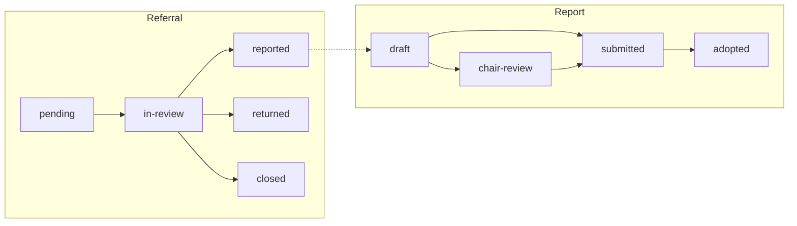
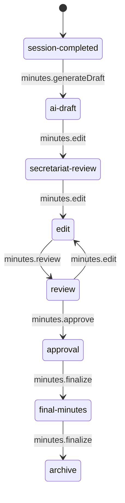
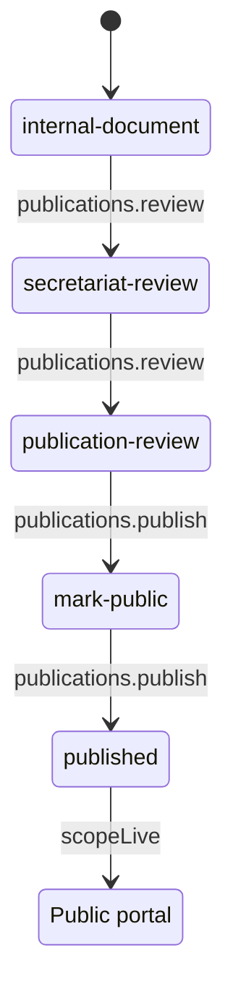
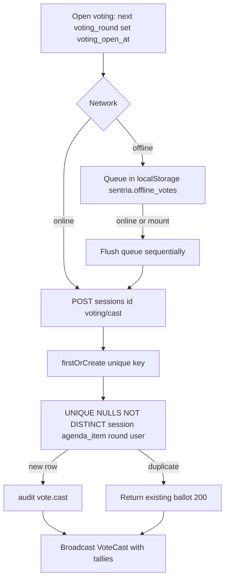

# Sentria — Process flows

As-implemented workflows from guarded state machines, controllers, and services. Entity relationships live in [erd.mmd](erd.mmd). Humans remain responsible for quorum, vote declarations, minutes approval, and publication.

Pasteable overview for [mermaid.live](https://mermaid.live): [business-process.mmd](business-process.mmd).

---

## 1. End-to-end legislative lifecycle

Document intake through public portal. Actors are labeled on the boxes they own.

Portal visibility requires a `publications` row in `published` with `published_at` set and `unpublished_at` null (`Publication::scopeLive()`). Unpublished records return **404**, not 403.

---

## 2. Session floor ritual

Session states from `app/States/Session/SessionStatus.php`. Live floor uses Echo on private channel `session.{id}`.

Echo events on `session.{id}`: `SessionStateChanged`, `AttendanceUpdated`, `MotionRecorded`, `FloorRecognitionUpdated`, `VotingOpened`, `VoteCast`, `VotingClosed`, `AgendaItemChanged`, `HallDisplayChanged`, `HallDisplayViewChanged`. Transcript uses `session-transcript.{id}`.

Standard agenda template (when preparing an empty agenda) follows the Sanggunian Order of Business: Call to Order; Convocation (Opening Prayer, National Anthem on the first regular session of the month, Municipal Hymn and Councilor's Creed); Roll Call; Reading and Consideration of the Minutes; Privilege Hour; Reference of Business; Committee Hour (Reports, Information, trial balance); Calendar of Business (Unfinished Business, Business for the Day, Unassigned Business); Business on Third and Final Reading; Other Matters / Announcements; Adjournment. Included measures are inserted under the matching heading so Adjournment stays last.

**As coded:** `present` and `late` count toward quorum; the system does not declare quorum. `sessions.declareQuorum` is seeded but has no route. Agenda advance requires `agenda.manage` (Secretariat). Board members seek recognition with **Raise a motion** (no text). A live dock alerts every floor surface until the presiding officer recognizes or dismisses, or the member cancels. The presiding officer or secretariat then records the spoken wording, attributed to the recognized member. Secretariat does not have `motions.create` except this on-behalf path.

**As coded:** states `minutes-for-review` → `finalized` → `archived` are declared on the session machine, but adjourn stops at `adjourned` and dispatches the minutes job. No HTTP route currently advances those post-adjourn session states.

---

## 3. Document IRP

Exact transitions from `app/States/Document/DocumentWorkflowStatus.php`. New uploads start at `submitted`. Transitions go through `GuardedStateTransition` (`POST /documents/{slug}/transition`).

Proposed ordinances follow the Sanggunian order (first reading, then committee, then second and third reading). Proposed resolutions follow the same path through second reading, where the floor vote adopts or rejects them; they do not go to third reading. Other document types keep the shorter register → refer path. The numbered ordinance/resolution register is a **separate manual record**: document IRP does not mint the citation.

Measure overlay:

1. Initiation / preparation — author files the measure (`Documents/Create`) with the secretary checklist (written file, number/title, enacting clause, proposed effectivity, explanatory note for ordinances, signed author).
2. Submission to secretary — `submitted` → `secretariat-review` → `registered`. Checklist is required before register.
3. Agenda / first reading — `registered` → `agenda-inclusion` with `current_reading = 1` (ready pool; no sitting chosen yet). Secretariat attaches the measure under Reference of Business when preparing that session's agenda. Floor shows **title only**.
4. Referral — after first reading, `reading-deliberation` → `committee-referral`. The committee meeting date on that first Refer is fixed. Blank: Second reading and Postpone appear on this sitting and on later postponements; the measure never joins a committee hearing, and Second reading closes the referral. Filled: the date is only a note, those buttons stay hidden, and the measure joins the next committee hearing whenever that agenda is prepared. Editing the date later does not switch the path.
5. Committee reports out — secretariat files the `committee_reports` row on the document page (`reports.submit`). The measure moves to `committee-report` and is queued under Committee Hour / Reports on the next regular session. A `defer` result stays in committee.
6. Committee Hour — while that Reports item is current, secretariat records the chair’s motion to adopt (no floor vote). Approve/amend sends the measure to this sitting’s Business for the Day as second reading (`agenda-inclusion`, `current_reading = 2`). Disapprove/no-action archives the measure.
7. Second reading — full copies, amendments, debate, voting. For **resolutions**, this vote is final: pass → `approved`, fail → `rejected`. For **ordinances**, fail returns to reading 2; pass goes to `final-document`.
8. Final form — ordinances only: secretariat prepares the form passed on second reading (`final-document`).
9. Third reading — ordinances only: attach `current_reading = 3` on the agenda, then final vote.
10. Passage — `approved` or `rejected`.
11. Sealing — stamp on the current version (`POST /documents/{slug}/seal`). Ayes/nays stay in the votes table; the official book is the numbered ordinance/resolution register, entered by hand on Legislation after real-life (or floor) approval.
12–16. LCE, SP, posting, and effectivity are typed dates on that ordinance (and on a resolution only when LCE/SP is required). They are not a progress bar and are not hard blocks.

**As coded:** Reaching `public-publication` does **not** publish to the portal — that is the publication workflow below. Creating a `committee_referrals` row does not auto-advance these IRP states. First reading hides the PDF on the floor; the desk copy remains on the document record. Recording an ordinance does not require third reading and does not change the linked document. Second reading is not legal from `committee-report` until the Committee Hour motion is recorded.

---

## 4. Committee referral and report

Operational records (`committee_referrals`, `committee_reports`) run beside the document IRP, not inside it.

Referral create: `POST /referrals` (status `pending`). Update allows `pending`, `in-review`, `reported`, `returned`, `closed`. Setting `reported` sets `completed_at` when missing. Overdue is `due_at` in the past and `completed_at` null.

Report create: `POST /reports` (`draft`). Secretariat files: `POST /reports/{id}/submit` from `draft` or `chair-review` (`submitted`), which queues the measure on the next regular session Reports heading. Floor adoption: `POST /sessions/{session}/agenda/{item}/committee-hour-motion` (`adopted`).

**As coded:** Desk `reports.adopt` is denied. Filing is a secretariat permission. A `defer` submit does not mark the referral reported or advance IRP.

---

## 5. Minutes

States from `app/States/Minutes/MinutesStatus.php`. Adjourn dispatches `GenerateMinutesDraftJob`, which builds a draft from attendance, agenda, motions, and the **`votes` table** (transcript is reference only).

AI may reach `ai-draft` only. Drafts carry an AI-generated banner. Presiding Officer approves (`minutes.approve`) and finalizes (`minutes.finalize`). Public minutes require session `is_public` and minutes status `final-minutes` or `archive`.

---

## 6. Publication to public portal

States from `app/States/Publication/PublicationWorkflowStatus.php`. This is the portal gate, not document IRP `public-publication`.

Entering `mark-public` or `published` sets `publication.published_at` / `published_by` and the linked `document.is_public` / `document.published_at`. `scopeLive()` requires status `published`, `published_at` not null, `unpublished_at` null. Anything else on `/portal` aborts **404**.

**As coded:** `publications.unpublish` is seeded without a route. Document IRP `public-publication` has no publication side effects.

---

## 7. Vote cast

One ballot per member per agenda item per round. Append-only; a correction is a new round.

Choices: `yes`, `no`, `abstain`, `inhibit` (CHECK). Open/close: Presiding Officer or Secretariat (`voting.open`). Cast: seated members (`voting.cast`). Closing a linked motion in `voting_open` sets `carried` or `lost` by yes > no. Electronic voting is not legally binding unless `SENTRIA_ELECTRONIC_VOTING_BINDING` is true.

Motion statuses (plain strings, not ModelStates): `proposed` → `seconded` → `voting_open` → `carried` / `lost`, or `withdrawn` / `ruled_out` / `referred` via API.
